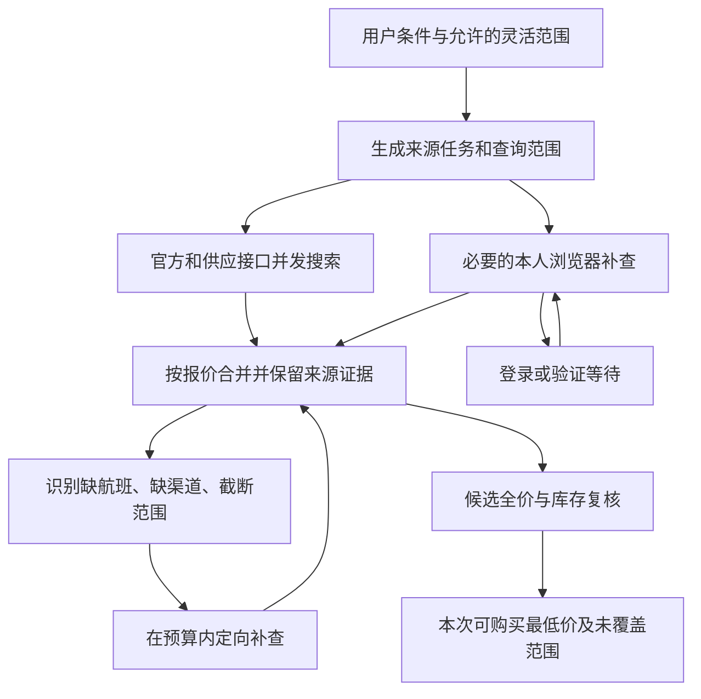

# Flight Lens：以找到更低可购买价格为目标的搜索重构

日期：2026-09-20。代码基线：`976fdf72244f1352bf0029ee250129d6e2e00022`。

本文根据用户最新澄清调整优先级：“精算之家”是口误，目标是找到真正便宜的机票，并减少搜索失败。
本文替代 [原实施计划](IMPLEMENTATION_PLAN_2026-09-20.md) 中“先做费用明细”的阶段顺序；其中报价证据和费用规则仍可复用。
这是研究结论与实施设计，不表示搜索引擎已完成重构，也不表示新商业接口已获得访问权限。

后续第一批代码实现与验证见 [实施记录](SEARCH_FOUNDATION_IMPLEMENTATION_2026-09-20.md)。本文中的缺陷描述保留为修改前的基线。

## 1. 决策

采用 **结构化接口承担基础搜索 + 有针对性的浏览器补查 + 可恢复的独立来源任务**。
保留现有 UI、Next.js、Fastify、contracts 和已可用的来源适配器，重做查询编排与来源结果合并。

有方法超越“每次打开所有平台网页再读前几条”的主流程。项目已经接入 FlyAI，说明基础搜索并不必须依赖浏览器。
但本轮没有找到、也没有验证任何一个接口能够提供所有国内平台、所有个人优惠的最低成交价。
接口是一种数据取得方式；其背后供应商、卖家、运价产品和用户资格，才决定能发现哪些低价。

近期投入顺序：

1. 消除已经确认的漏检和错误复用；失败来源必须留在任务记录中。
2. 用现有 FlyAI 做稳定基线，验证其搜索深度和定向查询能力。
3. 评估一个能增加国内独立报价的供应接口，以实际低价增量和可购买性决定接入。
4. 浏览器用于接口遗漏的渠道、卖家产品和本人的适用优惠；登录后能够继续该来源的任务。
5. 在上述候选中比较完整应付金额并购买前复核。费用完整性是比较前提，不能替代候选覆盖。

## 2. 第一性原理：便宜票如何丢失

一次搜索的候选空间是：允许的日期与机场 × 航班或合法行程组合 × 销售渠道 × 卖家/运价产品 × 用户优惠资格。
系统只能从实际取得且仍可购买的候选中选出最低价。排序算法无法找回从未采集到的候选。

因此，必须分别回答四个问题：

| 问题 | 对结果的影响 | 应保存的证据 |
| --- | --- | --- |
| 查了哪些独立内容？ | 多个接口可能提供同一批供应，也可能同平台不同入口提供不同产品 | 平台、接口、供应来源、卖家和产品标识 |
| 查询范围正确且完整吗？ | 城市替代机场、只读第一页、只取一种产品都会漏价 | 实际执行条件、页数/游标、截断原因、缺失字段 |
| 来源成功完成了吗？ | 登录、超时、额度不足不能解释为“没有便宜票” | 每次尝试的状态、失败原因、是否可继续 |
| 这个价对本人可买吗？ | 票面价、批发净价、未知资格优惠可能无法成为实际低价 | 必付金额、资格、有效时间及购买入口 |

精确条件和灵活搜索分开。用户指定首都到虹桥时不能暗中改成大兴到浦东；用户接受附近机场和日期浮动时，才扩展组合。
灵活日期需要明确是完整日期集合还是抽样，不能把边界三点查询称为整个日期范围的最低价。
往返原生报价和两张单程分别比较并说明购买方式；不能假定相加必然最便宜。

## 3. 当前已经有证据的问题

### 3.1 线上实测

2026-09-20 约 21:46，北京时间，查询 2026-10-20 PEK → SHA，1 成人、经济舱、直飞。
用户登录去哪儿后，该来源返回 20 条，平台列表有 11 页；但当前页面实际查询北京 → 上海城市范围。
这 20 条均未满足本次精确机场与直飞条件，被结果过滤。扩展没有继续翻页查找其他符合条件的候选。

这是一个明确的漏检机制；它不能证明后面一定有更低价，但证明本次采集不能支持“去哪儿已经查全”的结论。
同轮 FlyAI 返回 10 条，携程和同程各 30 条，SerpApi 显示限流。10 条是这次观察结果，未证明是 FlyAI 服务的固定上限。
SerpApi 的界面状态也不足以区分供应商瞬时限流与账户额度耗尽，需要记录原始分类后的错误原因。

原始本地发布/搜索记录保存在忽略目录 `work/local-preview/NETLIFY_DEPLOYMENT_2026-09-20.md`。

### 3.2 代码与离线复现

| 问题 | 证据位置 | 具体后果 |
| --- | --- | --- |
| 城市范围替代精确机场，缺少完整上游筛选 | `apps/edge-companion/background.js`：`CITY_NAMES`、`buildUrl` | 前页的其他机场结果占据采样名额，事后过滤无法恢复漏掉的航班 |
| 采集截断 | `platform-content.js`：多处 `slice(0, 50)`；`browser-ota.ts`：`mapDomCards` 的 `slice(0, 30)` | 更多候选和后页结果未进入比较；增加页面 Logo 不能修复 |
| 失败来源被忽略 | `packages/connectors/src/index.ts`：`withCompanionConnectors` 只接受 success 且有 cards 的结果 | 云端无对应替代来源时，需要登录的来源从最终来源列表消失 |
| 浏览器成功替换整个同平台接口 | 同一函数按 `inventoryFamily` replacement | 浏览器样本可能更少，公共接口的不同候选被整体移除；同平台不能等同于同一产品集合 |
| 新采集结果被共享缓存覆盖 | `executionCacheKey` 只有 connector id 与 intent；`executeConnector` 先读缓存 | 默认 60 秒内，同条件新浏览器观察可能不被执行；键也缺少用户/会话隔离 |
| 快来源等待慢来源 | `apps/web/app/page.tsx`：先 await `searchWithEdgeCompanion`，再请求 `/v1/searches`；扩展先 Promise.all | 云端接口不能先返回；一个慢网页拖长整个首屏等待 |
| 登录后任务无法续跑 | `background.js`：登录/验证码状态保留页面并结束当次任务 | 用户已经登录，原搜索却不会自动恢复；重跑又重复执行其他来源 |
| 灵活日期只查三点 | `searchVariants`：`[-flexibleDays, 0, +flexibleDays]` | 例如 ±3 天只查 3 天，中间 4 天未覆盖；往返日期同时平移，也未枚举独立组合 |

离线诊断脚本：`work/local-preview/search-foundation-probe.mjs`。使用真实生产函数与合成卡片，无供应商调用，无真实用户数据。
通过 Node 22、development exports、tsx 执行，全部断言通过：

```text
第一次浏览器观察：52000 分
第二次新观察直接映射：39900 分
第二次经 executeConnector 返回：52000 分，CACHE_HIT
无服务器替代时，login_required 来源保留数：0
加入成功的飞猪浏览器结果后：fliggy-flyai 被替换为 fliggy-edge-companion
```

上述 520/399 元是测试数据，不是实时票价。缓存测试证明相同条件的新观察能被旧观察覆盖；
跨用户共享属于代码层面风险，本轮未做线上跨账号实验。

## 4. 可以替代网页主搜索的途径

### A. 现有 FlyAI：立即可研究的基线

项目已安装 `@fly-ai/flyai-cli@1.0.16`，服务端调用官方 CLI；包的 README 说明其使用 streamable_http MCP。
这条路径不需要打开飞猪网页。已安装 CLI 的 `search-flight --help` 提供航班号、出发日期区间、往返日期区间、
起降时段、舱等和价格排序等条件；当前适配器只使用其中一部分。

最有价值的下一次验证是：宽泛查询没返回的已知航班，按航班号和更精确时间范围查询能否取得；
新结果是否有额外卖家/运价、真实购买入口及税费信息。CLI 帮助没有暴露分页或乘客人数参数，不能自行假设完整覆盖。
目前映射会将单成人价格乘以人数；多人库存和同价可售性仍待证实。

保持官方支持的调用方式，不以逆向签名或修改设备信息作为扩容方案。MCP/AI 工具接口本身不会增加其背后的库存。
平台入口：[FlyAI](https://flyai.open.fliggy.com/)。本轮该网站网页抓取超时；上述已支持参数以本地安装包帮助为依据。

### B. 分销聚合接口：有望增加内容，须先验证商业可用性

[PKFARE 官方介绍](https://www.pkfare.com/cn/flight) 声明其供应来自 GDS（包括中国航信）、航司直连及第三方，提供查询、预订与出票接口。
这是供应商自己的覆盖描述，不是本项目对国内低价覆盖的实测结论。
[接入说明](https://apifox.pkfare.com/apidoc/docs-site/345083) 要求买家/开发者账户，并由业务经理提供 Partner ID 和 KEY。

将它作为一个候选进行取样验证，不能因文档公开就视为可以直接上线。购买方准入、费用、国内航线权限、查询配额、查定比和购买交接方式需先确定。
尤其要确认：仅提供比价、将用户转交购买的模式是否被支持。只能由代理出票的净价，未加服务成本且没有履约方时，不能作为消费者可购买最低价。

接入前应获得以下明确答案：

- 是否允许本项目规模及“比价后跳转”的产品模式；是否必须承担出票和售后。
- 国内全服务/低成本航司、直连/分销产品、人数库存及税费明细的实际覆盖。
- 搜索和复核费用、最低消费、并发、限流、查询与订单比例限制。
- 是否提供能继续购买同一报价的入口；报价失效后如何复核与替代。
- 能否提供生产性质的只读样本；测试环境票价不能用于证明低价效果。

本轮未提交商务申请、签约、购买套餐或取得新密钥。

### C. 飞猪开放平台：有公开文档，权限待确认

[国内单程机票搜索文档](https://open.alitrip.com/docs/api.htm?apiId=23247) 列出普通搜索、指定航班低价搜索、乘客人数和代理商/运价相关字段。
其“不需要授权”描述不等于不需要应用准入：公共参数仍包含 app key 和签名。
文档较旧，生产开放状态、应用权限及与 FlyAI 的内容差异均未验证；列为待核实入口，不作为已可接入的承诺。

### D. Skyscanner、GDS/NDC：不要把文档存在当作现成解法

[Skyscanner 当前申请页](https://www.partners.skyscanner.net/contact/travel-api) 要求商业用途并列出最低 10 万月活等条件，不适合作为当前个人项目必定能取得的主依赖。
现有 Google Flights/SerpApi 类聚合结果可保留为补充，但不能据此推断已经覆盖国内平台的个人补贴。

[IATA 对 NDC 的定义](https://www.iata.org/en/programs/airline-distribution/retailing/ndc/) 是航空商品与订单的数据交换标准。
采用标准和获得某航司的生产报价访问权限是两件事；新协议本身不会交付所有国内平台的价格。
直接接入多家航司需要逐家解决权限与内容，因此先评估合适的聚合供应，再按真实漏价补重点航司。

### E. 浏览器：保留为有目标的补查

官方接口拿不到的本人的渠道价、卖家产品和优惠仍需对应入口证据。
在用户授权的登录会话中，优先读取页面正常加载的结构化报价；必要时使用 DOM、筛选、翻页和产品展开。
这仍依赖平台会话，不能等同于独立稳定的官方 API。遇到登录或验证码保存任务并等待用户完成，然后继续。

App 专享或支付资格不在当前浏览器可见范围时记录覆盖缺口，不能把猜测的优惠当成已找到的价格。

## 5. 目标架构



### 5.1 任务与报价分开保存

每个来源任务在请求开始时登记，记录来源、查询分区、执行入口、尝试次数、耗时、错误、分页进度和是否完成。
建议状态：queued / running / waiting_user / partial / complete / failed / cancelled。
只有完成了预定范围且明确无匹配结果才能标为 empty；部分解析无结果、超时、未登录不等价。

公共 API 和浏览器立即分别启动，增量合并已完成结果。使用现有服务和存储承载任务，不先引入新的微服务集群。
按 source + query partition + attempt 识别重试，避免续跑再次插入重复报价；查询结束原因必须区分正常完成与预算耗尽。

### 5.2 保留同平台不同入口的增量

平台覆盖计数可以去重，但公共接口与本地会话结果都进入报价集合。
按行程、卖家、产品、价格适用条件识别重复，保留来源关系；相同航班不能把不同运价商品合成一条。
只有确认报价等价后才压缩显示。来源的可用性统计和内容覆盖统计分别计算。

公共行情缓存和个人浏览器观察分离。个人观察带会话与 observation id，不复用全局公开缓存；
新观察必须进入比较。旧缓存可作线索，但明确时效并在参与购买前重新确认。

### 5.3 按缺口扩大搜索

精确机场查询先在上游应用机场、人数、舱等、直飞等约束，再读取其匹配结果。
不支持某约束时保留宽查询，继续读完所需范围再过滤，同时说明成本与剩余缺口。
支持分页的来源按游标枚举；没有分页接口时，只使用官方支持的航班号/日期/时段分区补查，不假装已经枚举完全部报价。

选择核价顺序时可用已知价格和历史命中率，但不能只核前三条就宣布找到最低价。
只有取得适用的价格下界，才能证明更贵候选不可能胜出；未知优惠和费用时，下界推断可能无效。
达到预算仍未覆盖的范围保留为 partial，供用户继续深搜。根据样本测量决定预算，不先承诺固定延迟。

### 5.4 根据原因恢复

| 原因 | 恢复方式 |
| --- | --- |
| 登录/人工验证 | 保存当前来源、条件与阶段；用户完成后只恢复该来源 |
| 临时网络故障/服务端错误 | 有上限的退避重试，并使用独立来源补查 |
| 额度不足或查定比限制 | 暂停该来源，说明限制；循环重试不能解决配额问题 |
| 页面结构变化/解析无效 | 保存最小脱敏诊断、停用失效解析，其他来源继续 |
| 返回变价或库存消失 | 淘汰旧报价、记录新价并复核下一候选 |

## 6. 如何证明重构有效

先建立可重复的国内查询样本，比较三个实验组：当前版本、接口基线、接口加定向浏览器补查。
第一轮建议 20 条航线 × 3 个出发日期，共 60 个条件；覆盖多机场城市、不同出发提前量、全服务与低成本航司。
这是计划样本量，尚未执行。先固定单成人、经济舱、精确机场，再另建多人、往返和灵活日期样本，避免混淆问题。

同条件、相近时间采样，轮换执行顺序；对各组最低候选复核并保留前后价格。
遇到价格在窗口内变化，标记不确定或重测，避免把价格波动算成引擎改善。
人工对照至少覆盖携程、去哪儿、飞猪、同程及样本相关航司可访问的官方渠道；个人优惠只在相同账户资格下比较。
不提交订单，不将测试库存或无购买路径的净价算入结果。

参考最低价来自上述可访问来源共同发现并复核的候选池，称为“样本已知最低价”，不冒称全网真值。

| 指标 | 计算和解释 |
| --- | --- |
| 已知最低价命中率 | 系统找到同条件下参考最低价的案例数 / 有有效参考价案例数；容差在实验前固定 |
| 价差 | 系统最低可购买价减参考最低价，报告金额及百分比；无结果单列失败，不能从样本中隐藏 |
| 有效报价成功率 | 至少取得一个符合条件且可继续购买报价的查询数 / 全部查询数 |
| 来源完成率 | 完成计划范围的来源任务 / 全部计划来源任务，另列 partial 和 waiting_user |
| 等待与成本 | 首个有效结果及结束的 p50/p95，用量、浏览器操作次数和每个新增有效报价的成本 |
| 独立低价贡献 | 某来源独有候选、独有最低价案例数及节省金额，避免为重复内容付费 |

工程验收先要求确定性缺陷归零：11 页样本不再伪装为完整第一页；新观察不被旧缓存覆盖；失败来源不消失；
一个来源等待登录不阻止其他来源返回；同平台的不同入口报价不再被整体替换。
新供应商是否值得投入，取决于重复样本的低价增量、成功率、购买交接和费用，不能仅凭接口文档或单个便宜案例决定。

## 7. 实施顺序与第一批变更范围

| 顺序 | 交付内容 | 完成条件 |
| --- | --- | --- |
| 1 | 修复缓存隔离、来源失败保留、同平台报价合并 | 离线复现转为回归用例；所有合成场景正确，原有来源继续工作 |
| 2 | 云端与浏览器独立任务、增量结果、登录续跑 | 人为阻塞一个来源，其他结果可用；完成登录只继续未完成任务 |
| 3 | 机场条件、分页/分区、商品展开；FlyAI 定向补查实验 | 对既有漏检案例读到正确范围，显示实际完成度，记录补查增量 |
| 4 | 新国内供应接口的准入与小样本验证 | 取得实际权限、允许的业务模式和可购买路径，再接生产适配器 |
| 5 | 扩充样本并按价差迭代 | 公开样本统计，按导致漏价最多的原因继续优化 |

步骤 4 的资格确认可以与前面修复同步进行，但不能让未获得的商业权限阻塞现有漏检修复。
如果商业接口不适用，继续用 FlyAI + 改进后的浏览器进行相同实验；准确筛选、完整范围、独立任务和故障恢复仍然成立。

本轮已完成：代码追踪、线上证据复核、三个离线机制复现、官方渠道研究及此方案。
尚未完成：上述生产代码修改、新接口准入、60 条件对照实验与低价效果验证。现有线上版本仍是 `976fdf7`。
